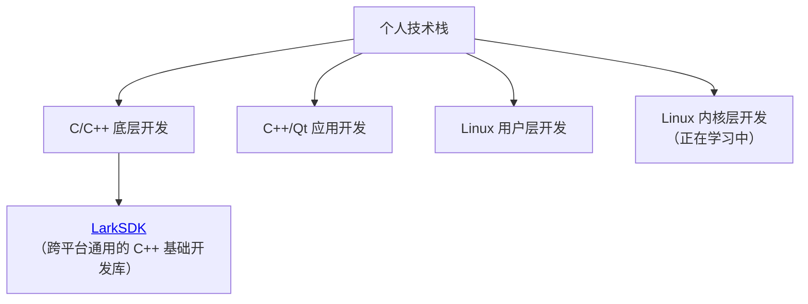

<meta name="referrer" content="no-referrer"/>

# 
关于

这里是 DavidingPlus 的博客，记录学习过程中的感悟和收获。本人的社交链接已经放在左边了，可以添加，相互交流学习。

本人是**电子科技大学**的**带砖生**，本科就读于着火的**沙软**专业。目前大四，保研到了清水河的**计算机学院**。本人目前是一名项目黑奴。

个人技术栈：

